 Install java 8  centos manually
 -------------------------------------
 * Here install java 8
 * [refer here](https://www.liquidweb.com/kb/install-java-8-on-centos-7/)
  ```
sudo yum -y update
sudo yum install java-1.8.0-openjdk
java -version
  ```
   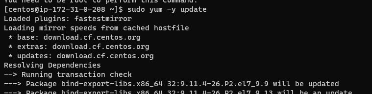
   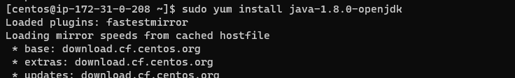
   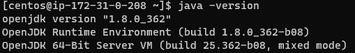

 Install java 11  centos manually
 -------------------------------------
 * Here install java 11
 * [refer here](https://linuxize.com/post/install-java-on-centos-7/)
  ```
sudo yum install java-11-openjdk-devel
java  -version
  ```
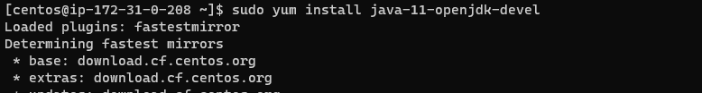
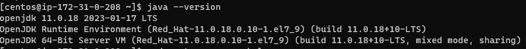

dotnet 7.0 install on centos manually
-------------------------------------
* Here install dotnet 7.0 
* [refer](https://learn.microsoft.com/en-us/dotnet/core/install/linux-centos)
  ```
  sudo rpm -Uvh https://packages.microsoft.com/config/centos/7/packages-microsoft-prod.rpm

  sudo yum install dotnet-sdk-7.0
  ```
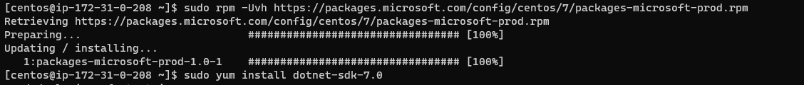
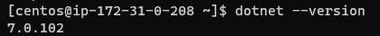

Nopcommerce application on ubuntu manually
------------------------------------------

* Here install nopcommerce
* [refer here](https://docs.nopcommerce.com/en/installation-and-upgrading/installing-nopcommerce/installing-on-linux.html)
  
 ```
  sudo apt update
  wget https://packages.microsoft.com/config/ubuntu/20.04/packages-microsoft-prod.deb -O packages-microsoft-prod.deb
  sudo dpkg -i packages-microsoft-prod.deb
  sudo apt-get update
  sudo apt-get install -y apt-transport-https aspnetcore-runtime-7.0
  dotnet --list-runtimes
  sudo apt-get install nginx
  sudo systemctl start nginx
  sudo systemctl status nginx
  sudo vi /etc/nginx/sites-available/default
   " # Default server configuration
#
server {
    listen 80 default_server;
    listen [::]:80 default_server;

    server_name   nopCommerce.com;

    location / {
    proxy_pass         http://localhost:5000;
    proxy_http_version 1.1;
    proxy_set_header   Upgrade $http_upgrade;
    proxy_set_header   Connection keep-alive;
    proxy_set_header   Host $host;
    proxy_cache_bypass $http_upgrade;
    proxy_set_header   X-Forwarded-For $proxy_add_x_forwarded_for;
    proxy_set_header   X-Forwarded-Proto $scheme;
    }

    # SSL configuration
    #
    # listen 443 ssl default_server;
    # listen [::]:443 ssl default_server;
    #
    # Note: You should disable gzip for SSL traffic.
    # See: https://bugs.debian.org/773332
    #
    # Read up on ssl_ciphers to ensure a secure configuration.
    # See: https://bugs.debian.org/765782
    #
    # Self signed certs generated by the ssl-cert package
    # Don't use them in a production server!
    #
    # include snippets/snakeoil.conf;
}    "
  sudo mkdir /var/www/nopCommerce
  cd /var/www/nopCommerce
  sudo wget https://github.com/nopSolutions/nopCommerce/releases/download/release-4.60.1/nopCommerce_4.60.1_NoSource_linux_x64.zip
  sudo apt-get install unzip
  sudo unzip nopCommerce_4.60.1_NoSource_linux_x64.zip
  sudo mkdir bin
  sudo mkdir logs
  cd ..
  sudo chgrp -R www-data nopCommerce/
  sudo chown -R www-data nopCommerce/
  sudo vi /etc/systemd/system/nopCommerce.service
" [Unit]
  Description=Example nopCommerce app running on Xubuntu

  [Service]
  WorkingDirectory=/var/www/nopCommerce
  ExecStart=/usr/bin/dotnet /var/www/nopCommerce/Nop.Web.dll
  Restart=always
  # Restart service after 10 seconds if the dotnet   service crashes:
  RestartSec=10
  KillSignal=SIGINT
  SyslogIdentifier=nopCommerce-example
  User=www-data
  Environment=ASPNETCORE_ENVIRONMENT=Production
  Environment=DOTNET_PRINT_TELEMETRY_MESSAGE=false

  [Install]
   WantedBy=multi-user.target   "
  sudo systemctl start nopCommerce.service
  sudo systemctl status nopCommerce.service
  sudo systemctl restart nginx
    "http://publicip/install"

 ``` 
 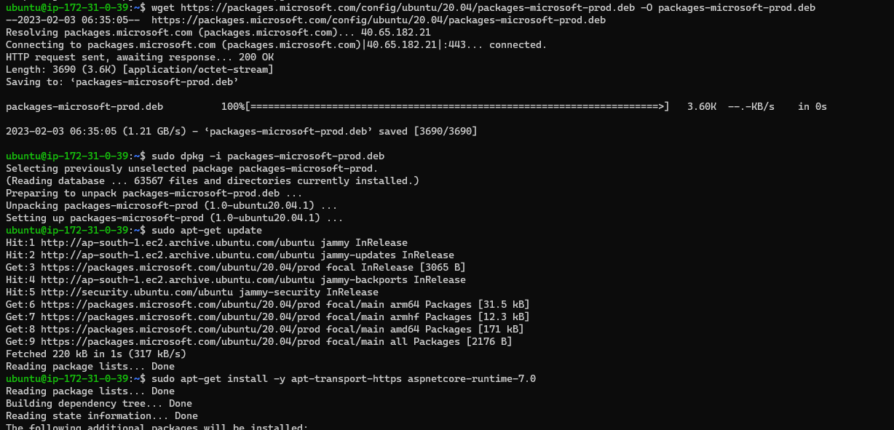
 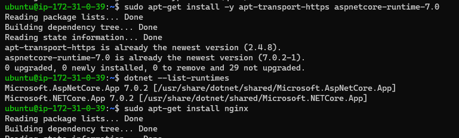
 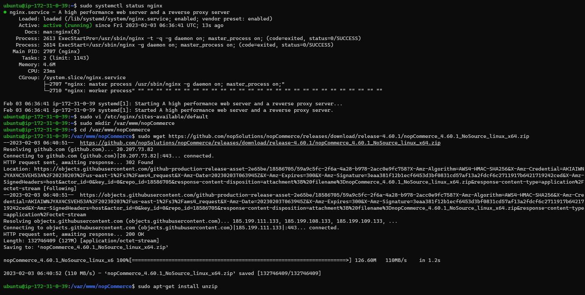
 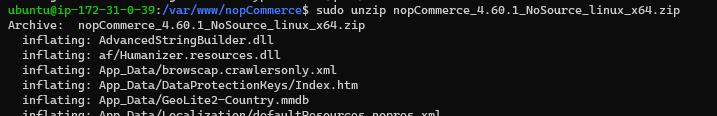
 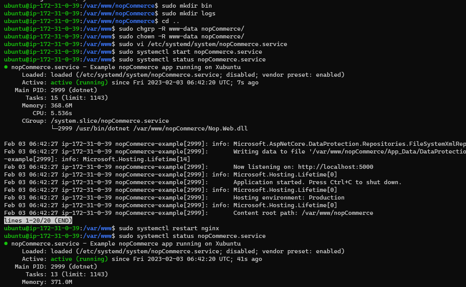
 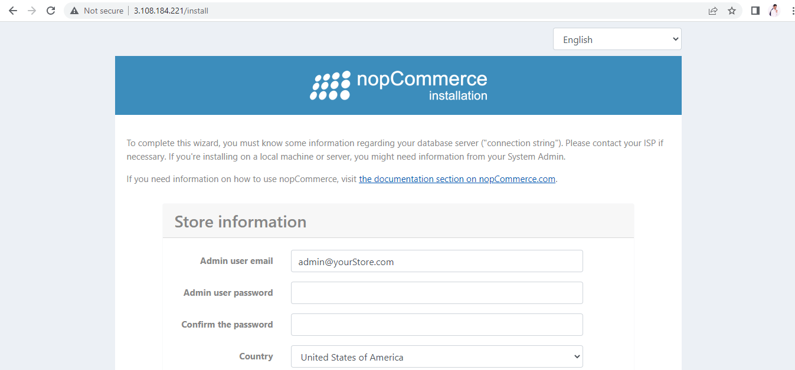

 OpenMRS in ubuntu manual
 ------------------------

* Here install openMRS
* [Refer here](https://github.com/krishnareddy219/openmrs-core)
  
```
   sudo apt update
   sudo apt install openjdk-11-jdk
   java --version
   sudo apt install maven
   mvn -version
   git clone https://github.com/openmrs/openmrs-core.git
   cd openmrs-core
   mvn clean package
   cd openmrs-core/webapp
   mvn jetty:run
     " https://publicip:8080/openmrs "
```
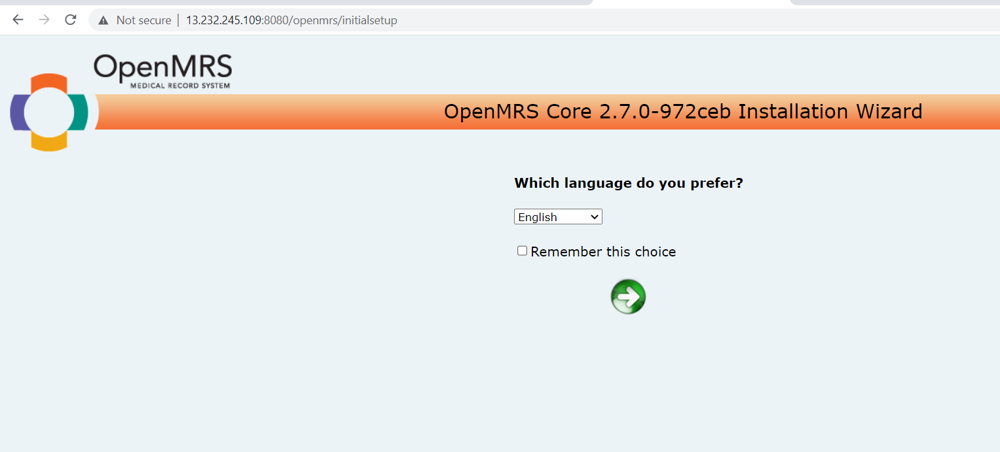