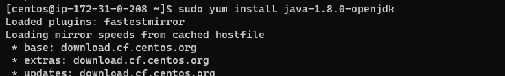
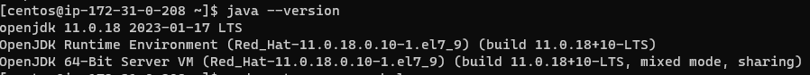
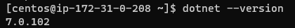

 Install java 8  centos manually
 -------------------------------------
 * Here install java 8
 * [refer here](https://www.liquidweb.com/kb/install-java-8-on-centos-7/)
  ```
sudo yum -y update
sudo yum install java-1.8.0-openjdk
java -version
  ```
   
   
   

 Install java 11  centos manually
 -------------------------------------
 * Here install java 11
 * [refer here](https://linuxize.com/post/install-java-on-centos-7/)
  ```
sudo yum install java-11-openjdk-devel
java  -version
  ```



dotnet 7.0 install on centos manually
-------------------------------------
* Here install dotnet 7.0 
* [refer](https://learn.microsoft.com/en-us/dotnet/core/install/linux-centos)
  ```
  sudo rpm -Uvh https://packages.microsoft.com/config/centos/7/packages-microsoft-prod.rpm

  sudo yum install dotnet-sdk-7.0
  ```


